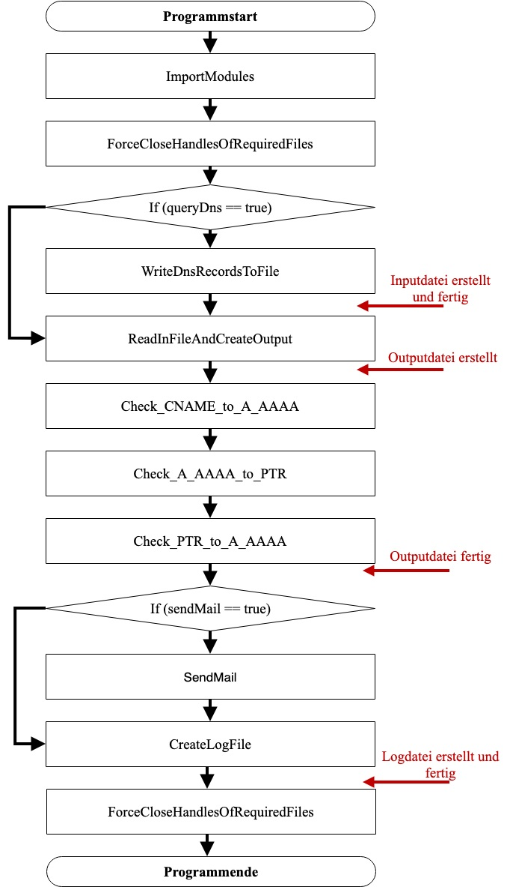
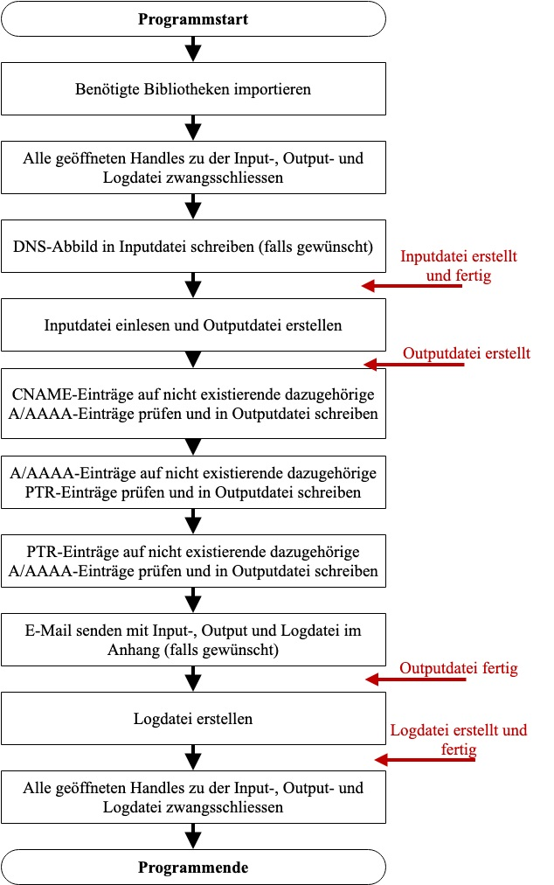

# About project
### Quality: **professional**
### Year of creation: 2015

## Scale of quality
**professional**
maintainable, scalable and performing -> well thought out architecture, clean structure, complete documentation

**prototyping**
maintainable and scalable to a certain extent -> rough architecture, clean structure, readable

**OK**
maintainable -> clean structure, readable

**hacky**
just good enough to run

# DNSCleaner
A PowerShell Script I've built to learn about Windows Scripting. It marks relicts and inconsistent entries in Microsoft Domain Name Systems.

## Prerequisites
- Microsoft DNS with at least one forward and one reverse zone
- Powershell 4.0
- If script should access Microsoft DNS remotly the following protocols and ports need to be allowed by the firewall
	- ICMP
	- DNS (53/UDP, 53/TCP)
	- SMTP (25/TCP, 465/TCP or 587/TCP according to settings in script)
- Administrator privilege for the powershell the script runs in
- Libraries and binaries in the same directory as the script
	- DNSShell.dll
	- HANDLE.psm1
	- [handle.exe](https://docs.microsoft.com/en-us/sysinternals/downloads/handle)

## Settings
**inputFile**
Full path and name of automatically generated input file

**outputFile**
Full path and name of automatically generated output file

**logFile**
Full path and name of automatically generated log file

**server**
Hostname or IP-Address of DNS

**zone**
All DNS zones with their full names that should be checked. At least one forward and one reverse zone is required.

**forwardZoneFilter**
Regex to filter forward zone entries

**queryDNS** 
*true*: Query DNS and generate a new input file 
*false*: Search for an existing input file

**sendMail** 
*true*: Sends an e-mail with input, output and log according to the settings below 
*false*: No e-mail gets sent 
This is especially useful if the script is executed by a task scheduler

**From**
e-mail sender address

**To**
e-mail target address

**Subject**
e-mail subject

**Body**
e-mail body

**SMTPServer**
e-mail SMTP-Server which processes the e-mail

**SMTPPort**
e-mail SMTP-Server port (note: use 25 if not sure)

**Credentials**
e-mail username and password of the sending account

## Script Logic
**Left:** Function calls ("Logic" section in script) 
**Right:** Process explanation (in german)

	
	

